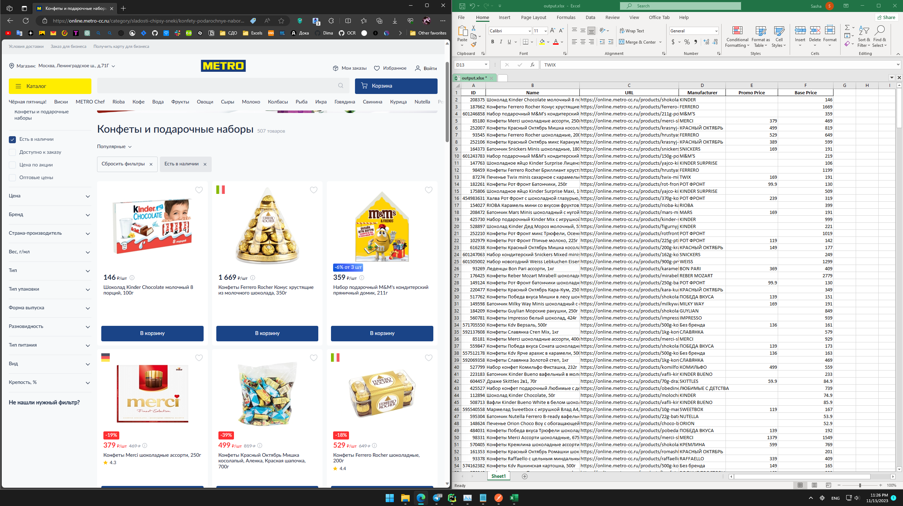

# Тестовое задание для MillionAgents

### Задание:

Hard. Написать парсер для сайта Метро (https://online.metro-cc.ru/)

### Ход работы:

    Сначала решил асинхронно скачать страницы через aiohttp и запарсить через bs4 (можете глянуть папку draft), 
    но как оказалось, на скачанных страницах нет информации о цене(

    Селениум использовать очень не хотелось, 
    будет работать не так быстро + потреблять больше ресурсов 

    Полез во вкладку нетворк, в инструментах разработчика, 
    что бы глянуть как мы получаем данные о ценах, и встретил graphql. До этого с ним не работал, но общее представление имею.
    Быстренько накидал запрос, который тянет всю нужную информацию, а уже после - пару условий в питоне. 
    В итоге получился простой и быстрый скрипт.

### Запуск:

Установите зависимости из файла requirement.txt при помощи `pip install -r requirements.txt` или воспользуйтесь
poetry)  
После чего необходимо запустить файл `main_graphql.py`. В директории появится или обновится файл output.xlsx с
результатами парсинга.